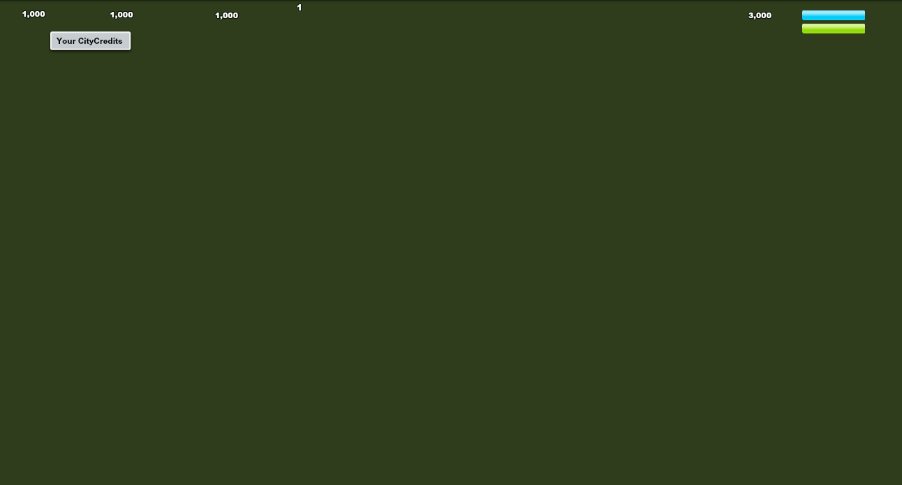

This page should contain the game flow from loading to in-game. This will highlight noticeable client behavior and the part that interacts with the server.

### Bootstrap Loading

Starting from the browser loading SWF file.

1. Located in the file `_Main_net_bigpoint_cityrama_init_SystemManager`, the game construct `RSLData` object and request to download few “SWZ” files from `fpdownload.adobe.com`. These are libraries files established by the Flex engine.

:::note
We didn't modify the client to route the download to localhost.
:::

2. Client proceeds to load 3 XML files: `settings.xml`, `cvRuntimeLinks.xml`, and `cvFileLinks.xml`, which are essential configuration and assets links.

:::caution
Client hard coded their requests to `xml/filename.xml`, we chose to keep as is and modify the server to serve via everything from `xml` folder.
:::

3. Client loads various locale files depending on the locale set in the flashvars.

### Begin Socket Connection

4. Client makes a request to `RCApi` with single param of `session=test` (depend on `FlashVarsProxy`). This request is made by `ServerConfigProxy.loadServer`, where the incoming response is processed in the `onComplete` method.
5. Upon receiving server's host and port, the client create a temporary socket connection and make a policy request to the specified policy port (hard coded in `ServerCommunicationProxy`).
6. Then, another socket connection is created, reconnecting to the socket server (specified from `RCApi` or can be overridden in `settings.xml`).

### Authentication

7. First message sent after reconnecting is a `LOGIN` message with a JSON payload of `uid` (user ID) and `ses` (session name).
8. The response that client expects is a message with the header of `SERVER_MESSAGE_LOGIN_SUCCESS` with JSON payload of `ConfigDTO` and `PlayerDTO`, which contains game configuration from server and player's basic game data.
