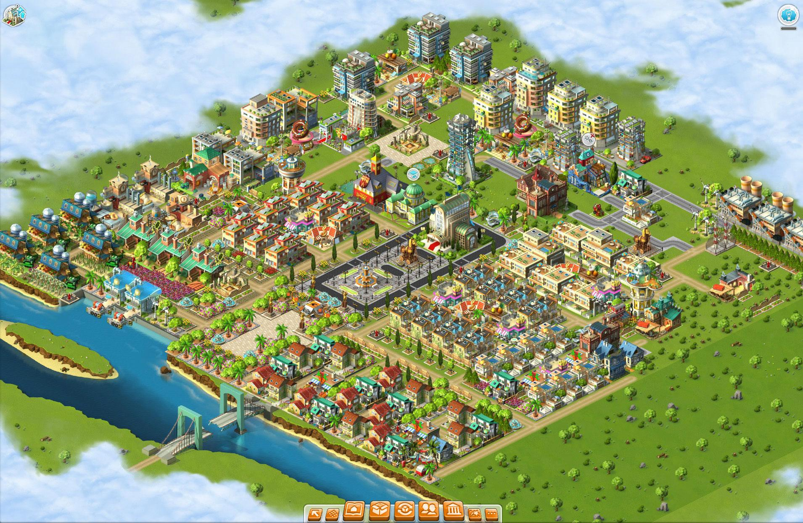

Documentation about Rising Cities client.

See [flow](./flow)

### Redirection

There are few redirections that must be done to route the game into your server:

1. `RCApi`, which is requested after early XML files, is supposed to return the socket server host and port.
2. `FlashVarsProxy.policyPort` should return the port of policy file server.
3. `ServerCommunicationProxy.connect` contains additional port of policy file server (hard coded to string).
4. `settings.xml` can override `RCApi` response, which is initialized by `DeveloperSettingsProxy`.

### Logging

The game has several ways to log:

1. Log to server via `net.bigpoint.util.DebugLayer.as`, which makes a POST request to the `debugLayerUrl` set from flash variables. Must enable `debug` to activate this. This log mainly tells about client-server communication, called by `readMessage` and `writeMessage` of `ServerCommunicationProxy`.
2. Frequent (default 10 seconds) client logging, mostly about performance metrics via `net.bigpoint.eventstream.EventStreamClient.as`, which makes a POST request to a hard coded URL at line 208 under `ESCRequestVo`, and sends a JSON payload compressed using `zlib` (via AS3 `ByteArray.compress`).
3. Local client logging via `net.bigpoint.util.CityramaLogger`, not sure where is this log routed to.
